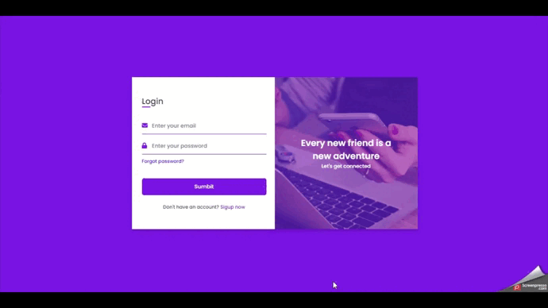

## TodoList-TaskManiger
This is a TodoList-TaskManiger created by (Ajax  ,  PHP  , composer).

Geting Started
==============
1-turn your xampp control
2-move this file in the "C:xampp/htdocs/" then uplod in xampp dashbord
3-import sql in the database and use this project

discription
==============
in todolist project you can creat task and folder and watch task status 
meantime you can regester and login this page and watch your tasks and folders.


 bootstrap/constants.php File Help
==============

For Change Title Site Just Edit This Define:

```
 define('SITE_TITLE','TodoList-TaskManiger');


#Demo
==============




Xampp version
==============
xampp control panel  v3.3.0 
